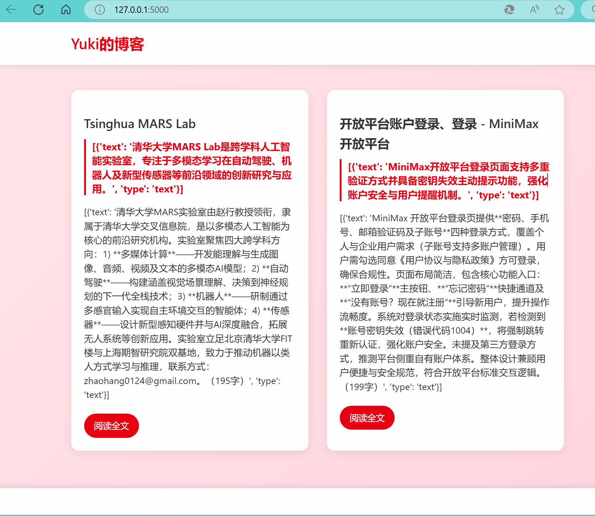

# 个人博客网站（飞书多维表格驱动）

这是一个基于 Flask 的个人博客网站，数据来源于飞书多维表格。采用苹果设计风格，融入中国红主题色，提供简洁优雅的阅读体验。




## 功能特点

1. 首页展示
   - 博客标题
   - 精选金句（加粗显示）
   - 点评内容
   - 文章预览（前100字）
   - 新标签页打开文章详情

2. 文章详情页
   - 完整标题
   - 精选金句
   - 点评内容
   - 完整文章内容

## 技术栈

- 后端：Python Flask 3.0.0
- 前端：原生HTML/CSS，采用苹果设计风格
- 数据源：飞书多维表格

## 飞书配置要求

1. 创建飞书应用
   - 获取应用凭证（App ID 和 App Secret）
   - 开启多维表格权限：`bitable:record:read`

2. 创建多维表格
   - 创建包含以下字段的表格：
     * 标题
     * 金句输出
     * 黄叔点评
     * 概要内容输出

## 快速开始

1. 克隆项目后，创建以下目录结构：
```
blog/
├── README.md
├── requirements.txt
├── config.py           # 配置文件
├── app.py             # 主应用
├── static/            # 静态文件
│   ├── css/
│   └── js/
└── templates/         # HTML模板
    ├── base.html     # 基础模板
    ├── index.html    # 首页
    └── detail.html   # 详情页
```

2. 安装依赖：
```bash
pip install -r requirements.txt
```

3. 配置飞书应用信息
在 `config.py` 中填入您的飞书应用信息：
```python
class Config:
    # 飞书应用配置
    FEISHU_APP_ID="cli_a7567701b276100c"
    FEISHU_APP_SECRET="t3FoUoPAFmfNUHkplEEZXe6Wena5l3K6"
    
    # 多维表格配置
    BASE_ID="R3jwbqxMraFRgZsId9FcGdxRn1c"
    TABLE_ID="tbl5FExHceWLJaBQ"
```

4. 运行应用：
```bash
python app.py
```

5. 访问网站：
打开浏览器访问 http://localhost:5000

## 常见问题

1. 数据显示异常
   - 检查飞书应用权限是否正确开启
   - 验证多维表格的字段名称是否与代码中完全一致
   - 确认表格中已添加数据

2. 样式显示问题
   - 确保所有模板文件都在 `templates` 目录下
   - 检查浏览器是否支持现代CSS特性

## 注意事项

1. 数据安全
   - 不要在代码中直接硬编码飞书应用凭证
   - 建议使用环境变量或配置文件管理敏感信息

2. 性能优化
   - 已添加数据缓存机制
   - 优化了图片和样式加载

## 开发建议

1. 本地开发
   - 使用 Flask 的调试模式便于开发
   - 修改代码后会自动重载

2. 数据管理
   - 在飞书多维表格中编辑内容
   - 支持实时更新，无需重启应用

## 项目维护

如需帮助或报告问题，请提供以下信息：
1. 完整的错误信息
2. 飞书应用配置截图
3. 多维表格的结构说明

## 后续优化方向

1. 添加文章分类功能
2. 实现搜索功能
3. 添加评论系统
4. 优化移动端体验
